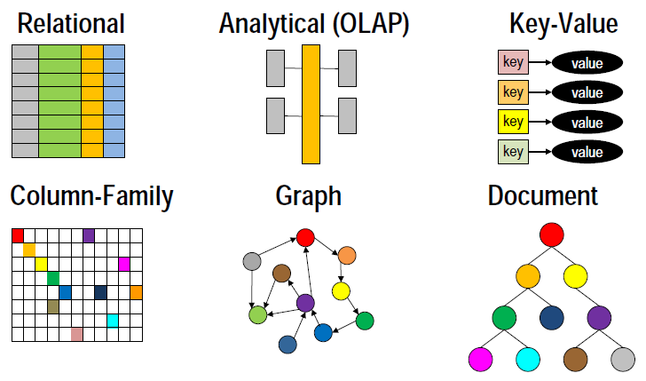
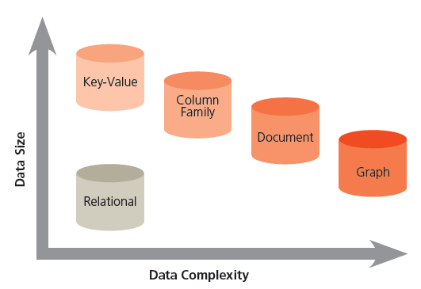

# Databases

## Intro

For the early part of my career, Relational Database Management Systems (RDBMS) and flat files were the only real options for storing data used by an application.  Recently, I keep hearing about teams using Cassandra or MongoDB, and I realized that my knowledge is a bit out-of-date.  This page will document the conceptual differences between these databases with just enough information to get the basic idea.

## Types of Databases

"NoSQL" databases didn't become mainstream until about 2009-2010.  Until then, almost all applications used an RDBMS or an OLAP cube (think Essbase or a Star Schema RDBMS).  Key-Value, Column-Family, Document, and Graph databases are the most common examples of NoSQL databases available today.  Mainly, these were built to handle cases where the RDBM systems were either too unable to scale and maintain performance or in cases where the data structure simply was not a good fit for the RDBMs.

InfoWorld organizes these using the following helpful graphic, illustrating the trade-off between data size (really, performance at scale) and data complexity.  Key-value stores are the fastest types of databases, but only because they do not allow complicated data structures or relationships between data.  Column family and document databases like Cassandra and MongoDB seem to be the most popular of the NoSQL databases, as these offer superior performance to relational systems while still allowing some understanding, indexing and querying of the data.

Summaries of each of these database types and how they relate to each other are in the table below.

| Database Type | Examples | Description |
|---------------|----------|-------------|
| RDBMS         | Oracle MySQL SQL Server PostgresSQL DB2 Access Informix | RDBMS = Relational Database Management System. Classical databases maintaining data in tables consisting of rows and columns. Every row must have a value for each column (even if that value is NULL). Has an advanced, standardized SQL interface that allows for powerful queries, joins, and aggregations.  __Pros:__ Mature ACID transactions with fine-grain security controls. Standardized SQL interfaces supported by every programming languages By far the most popular database with the deepest pool of talent and experience. __Cons:__ Data model must be defined up-front. Does not scale well or handle sparse datasets well. |
| OLAP | Essbase RDBMS (such as DB2, with star schema) | OLAP = Online Analytical Processing. Database structured around a "star schema" with a central fact table and de-normalized dimension tables. Also known as a data "cube." MDX query language can be used to aggregate data at the desired level. These types of databases are used by finance teams (Essbase) and the data warehouse (DB2 w/ star schema).  __Pros:__ Fast queries for large data __Cons:__ Not optimized for transactions and updates |
| Key-Value Store | Berkley DB Memcache DynamoDB | Keys are used to access data that is stored as blobs. The database doesn't know anything about what is actually stored in those blobs. It simply offers the ability to retrieve the value associated with a given key. Only 3 operations are supported: creating a new key-value mapping, updating the value of an existing mapping, or deleting an entry. This is the simplest, fastest type of database and scales the best, but since the database knows nothing about the data being stored, it does not allow any kind of filtering, joining, or aggregation of data.  __Pros:__ scalable, simple API (put, get, delete) __Cons:__ no way to query based on the content of the value |
| Column Family | Cassandra HBase | "Column family" or "big table" databases allow very sparse data to be stored and queried efficiently. Imagine rows that have millions of columns but with sparse data where not all rows will have a value for each column. Internally, these are implemented as "key-value" stores where the key combines both a row and column identifier, and are built in such a way that one can quickly traverse all columns associated with a row or all rows associated with a column. However, getting a list of all columns or all rows in the entire database can be difficult.  The database is called a "column family" because we can define a set of columns and get use cases very similar to those of an RDBMS table. CQL (Cassandra Query Language) actually looks identical to SQL, making this easy to pick up for traditional developers. Cassandra also scales linearly and is prized for its lightning speed and architecture which allows it to scale linearly while offering built-in redundancy and seamless failover.  __Pros:__ Good scaling, redundancy, and versioning. __Cons:__ Does not allow joins. Row and column designs are critical. |
| Document | MongoDB Couchbase CouchDB | Data is stored in nested hierarchies. This is again similar to a key-value data store, except that the keys understand the hierarchical nature of the data, and the data values are also likely to be indexed and searchable. MongoDB is the leader in this field, and it's primary use case is storing JSON data. JSON data is hierarchical in nature. MongoDB lets you store this unstructured data without defining any schemas and will still index the data and make it searchable by any property in the JSON object. The query language used with MongoDB is also JSON-like. MongoDB is the most popular NoSQL database by far due to how well it works with web applications. For years, web applications built middle tier layers that read from an RDBMs and translated the data into JSON. MongoDB removes the middle-tier, allowing the application to persist the data in the same format in which is uses the data.  __Pros:__ No object-relational mapping layer, ideal for search __Cons:__ Complex to implement, incompatible with SQL |
| Graph Store	| Neo4j OrientDB Titan | Data is stored in a series of nodes with properties and relationships between them. queries are really graph traversals. This is ideal for use cases where the relationships between data is key (i.e. social networks and "friend of a friend" queries).  __Pros:__ fast network search, wrks with public linked data sets __Cons:__ Poor scalability when graphs don't fit into RAM, specialized query languages (RDF uses SPARQL) |
| Other Types | | DB Engine Rankings also list the following types of databases (although they are not nearly as popular as the ones listed above): Time Series DBMS, RDF stores, Native XML DBMS, Object-oriented DBMS, Navigational DBMS, Event Stores, Multivalue DBMS, Search engines |

NOTE: Example databases above are listed in order of their popularity (as shown on [DB Engine Rankings](http://db-engines.com/en/ranking)).

## Resources

* [MongoDB, Cassandra, and HBase - The 3 NoSQL databases to watch](http://www.infoworld.com/article/2848722/nosql/mongodb-cassandra-hbase-three-nosql-databases-to-watch.html) - Makes the case that these 3 databases are winning the market based on LinkedIn and DB Engine Ranking data.
* [DB Engines Ranking](http://db-engines.com/en/ranking) - Great site that ranks the popularity of databases based on job postings, searchings, and other data
