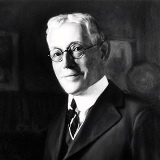
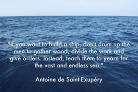

# Quotes

## Barney Kroger

> “Success isn’t measured by  how much merchandise you sell.
> Real success is found in the development of,
> and opportunities you provide
> for the people who are selling it.” - Barney Kroger

## Peter Drucker

"People who don't take risks generally make about two big mistakes a year.  People who do take risks generally make about two big mistakes a year."

"If you want something new, you have to stop doing something old."

"Doing the right thing is more important than doing the thing right."

"There is nothing quite so useless as doing with great efficiency something that should not be done at all."

"What gets measured gets improved."

"So much of what we call management consists of making it difficult for people to work."

"Meetings are by definition a concession to a deficient organization.  For one either meets or one works.  One cannot do both at the same time."

"Results are gained by exploiting opportunities, not by solving problems."

"Long-range planning does not deal with future decisions, but with the future of present decisions."

"Management is doing things right.  Leadership is doing the right things."

## Assange

"If you want to build a ship, don't drum up people to collect wood and don't assign them tasks and work, but rather teach them to long for the endless immensity of the seas." - Antoine de Saint-Exupery.

(This quote was used by Julian Assange in many of his email signatures.  The quote is not exact.  It is a very liberal paraphrase of a story from the book "Citadel".  See [this link](https://quoteinvestigator.com/2015/08/25/sea/) for an investigation into the source of this quote.)

## Various

"You don't build a business. You build people, and people build the business." - Zig Ziglar

“If the path before you is clear, you’re probably on someone else’s.” – Joseph Campbell

“Beware the gravitational pull of mediocrity.”

"We’re not nameless. We’re not faceless. We were born for greatness" - Papa Roach

"Always remember that you are absolutely unique.  Just like everyone else." - Margaret Mead

"No score.  No game." - Ken Blanchard (Gung Ho!)

"I wish to have no connection with any ship that does not sail fast; for I intend to go in harm's way." - John Paul Jones

"If we have data, let’s look at data. If all we have are opinions, let’s go with mine." - Jim Barksdale (President and Chief Investment Officer of Equity Investment Corporation).  For more good quotes and commentary see this page.

"A little retrospection shows that although many fine, useful software systems have been designed by committees and built as part of multipart projects, those software systems that have excited passionate fans are those that are the products of one or a few designing minds, great designers.” - Fred Brooks, Jr. (Computer Architect, IBM)
